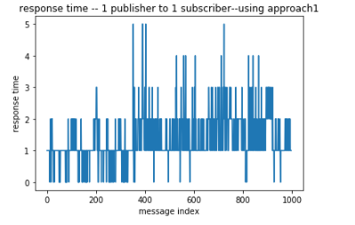

# Assn2_DSP
## Team member(T4)
Wei Fan(wei.fan@vanderbilt.edu Github id: FWWorks)  
Dingjie Su(dingjie.su@Vanderbilt.Edu Github id: sudmat)  
Zhehao Zeng(zhehao.zeng@vanderbilt.edu Github id: frankvandy2018) 

## Project code
https://github.com/FWWorks/Assn2_DSP

## Abstract
We built a layer upon the PUB/SUB model supported by ZMQ and ZooKeeper to support anonymity between publishers and subscribers. 
Based on what we did in assignment1, we use kazoo to support multiple brokers. Instead of publisher going for a broker, we now make a  publisher/subscriber goes to a zookeeper server to get the leader broker's address, then the data dissemination from publishers and subscribers is the same as assignment 1. eper. Join and Leave of entities is now handled via ZooKeeper via Watch mechanisms and the brokers do “leader election” using ZooKeeper. If Broker leadership changes, these entities will need to know the change. 
We also did experiments to get a sense of the impact on amount of data sent, latency of dissemination, pinpointing the source of bottlenecks.
The code is written in Python3.5 and we use Mininet to build single topologies to test our code, which runs on Linux Ubuntu.

## How to run our code

### 1 If you want to quickly verify the correctness of our program

You can run our unit test by the following steps,  
1 Start zookeeper on 127.0.0.1:2181 (the unit test does not depend on mininet, so make sure it is running at localhost).  
2 Execute "pytest test" in project home.

The unit test has covered the following content for both modes,  
1 Starting up broker, publisher and subscriber.  
2 Sending and receiving messages.  
3 Reconnecting to new broker leader when the old dies.  

This is a convenient and suggested way to grade our assignment.

### 2 If you want to manually test our program using a singple topology in mininet

Do as the following steps,  
1 Execute "sudo mn --topo=single,4" to create a simple topology.  
2 Execute "xterm h1 h2 h3 h4" to open windows for nodes.  
3 In h1, start up your zookeeper, which means the zookeeper should be started on 10.0.0.1:2181.  
4 In h2, execute "python3 start_broker.py config/test.ini Broker1" to start the broker.  
5 In h3, execute "python3 start_pub.py config/test.ini Pub1" to start the publisher.  
6 In h4, execute "python3 start_sub.py config/test.ini Sub1" to start the subscriber.  
7 In h3, enter the message you want to publish, watch the subscriber in h4 receiving it.

### 3 If you want to manually test our program using other topologies in mininet

In case you want to make further verification, you need to do some configuration work as the following steps,  
1 Define your topology in mininet.  
2 Modifiy the config/test.ini such that all the ip addresses are consistent with your topology.  
3 Start up all the related entities (zookeeper, broker, publisher, subscriber) in proper windows. The commands are similar to what are described above, but make sure you are using the right name to start up broker, publisher and subscriber.  
4 Enter the message you want to publish in publisher window(s), watch the subscriber(s) receiving it.

## Performance measurement
We collected the performance data and did some performance tests on the two approaches of pub/sub model we realized. Related code and data can be found in the 'performance data' file folder.

For simply notation, let's call the approach which subscribers get address of publisher from broker and request message directly from the publisher mode1/approach1, and the approach which subscribers receive messages from broker mode2/approach2. 

We measure performance according to the response time of intervals between a message being published by a publisher and reveived by a subscriber. For example, if a publisher publishs a message at time A, and this message is successfully received by a subscriber at time B, the intervals(B-A) is what we use to measure the preformance of pub/sub model. For each test, we generated 1000 messages and calculate the average response time and std response time.

We conducted performance by varying number of subscribers for both two approaches to see if data amount or subscriber amount will effect the response time. 

First, we did performance measurement test on mode1/approach1.

From this plot, we can see the response time of 1000 messages varies from 0~5 microseconds. Except some messages whose response time reach to 5 ms, most data instance show similar response time. We then conduct ploting the std of response time, the std is quite small, showing the system has a good stability. 

We then conducted measurement on 1 publisher-10 subscriber's model. From this plot we can see, with the subscriber's amount increasing, the average response time shows a positive correlation trend. 

Then we did the same experiments on mode2/approach2.

From these results, we can draw the same result like what is described in the tests of approach1, that is, the subscribers' amount influences the performance of response time. The more subscribers the network contains, the more time it takes to convey the message, which means a descrease in the performance. 
But, what makes approach1 and approach2 different is the response time range. It's obvious that using approach2 takes much more time than using approach1 under the same settings. So that's maybe where the bottleneck is, that it takes much time for broker to send messages to subscribers. So to solve this bottleneck, maybe we should do something to make the process of mapping publishers to subscribers faster.

